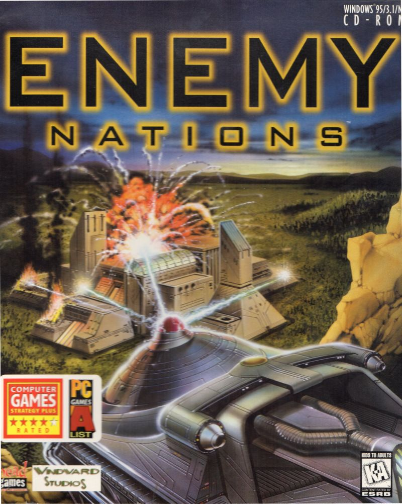

= Enemy Nations
Blair "Bobbias" Stacey <bobbias@gmail.com>
v1.0, $DATE$
:toc:
:imagesdir: /
:homepage: https://github.com/bobbias/EnemyNations
// see: https://asciidoctor.org/docs/user-manual/#table-of-contents-summary
:toc-title: Table of Contents
// how many headline levels to display in table of contents?
:toclevels: 2

== Introduction

Released in 1996 by https://en.wikipedia.org/wiki/Windward_Studios[Windward Studios], Enemy Nations is an RTS.
The premise of the story is that you, along with several other alien races, have discovered a planet to colonize, and
now you must all fight each other for the right to be the first to colonize this new planet.

The game was released as freeware in October 2005, and the game and source code was made available for download.

== Structure

The source code structure currently looks like this:

enations:: Source code from one source.
enations_latest:: mostly the same, but seems to be missing some parts.
src/cdf:: Another tool for building the final .dat file.
src/makeriff:: Duplication? of the makeriff source.
tools/compress:: Source for a compression tool.
tools/lib:: Holds a bunch of lib files potentially necessary for building the final game and tooling.
tools/makeriff:: A tool for assembling the final .dat file from the various components.
tools/mss:: Headers and libs for the version of the https://en.wikipedia.org/wiki/Miles_Sound_System[Miles Sound System]
tools/sprite:: A tool for working with the game's sprites.
the game uses.
tools/vdmplay:: A networking library that appears to be mostly in-house, although it makes use of both the Novell SDK
and a library by Rogue Wave.
tools/wing:: https://en.wikipedia.org/wiki/Enemy_Nations[WinG], the graphics library which predates DirectX and provided
high performance graphics to early Windows systems.

== Project Goals and Status

The ultimate goal of the project is to modernize the source code, and remove all outdated elements. This means removing
things like IPX networking, the CD requirement, and much more.

Currently, I am working on getting everything to compile with relatively minimal changes.

== Known issues

* There are many duplicate files throughout this repo.
* ccache location is hardcoded in CMakeLists.txt
* There are a ton of horrible hacks to try to get things to compile.
* Only works on windows.
